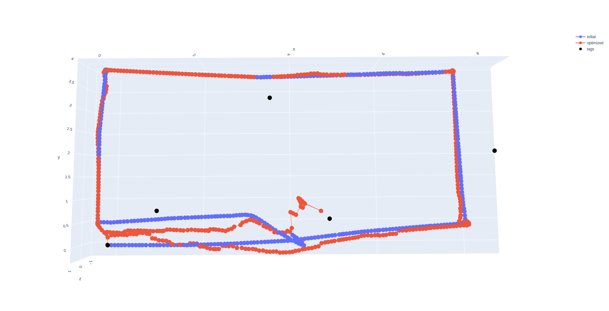

# CV Project Report

Bill Fan

## ⛳ What was the goal of your project?

For my computer vision project, I decided to solve a simplified version of the visual-SLAM problem, where a neato drives around in an environment with Apriltag fiducials and uses the combination of its odometry and camera video stream to map out where the Apriltags are, and where it is itself. One major reason for combining Apriltags with odometry is to correct for the inevitable accumulated errors of odometry. Because wheel odometry sensors are integrated to compute overall robot displacements, small errors at specific moments, such as wheel slippage, can accumulate over time into a large error: if the robot wheel slips at one time, then every future pose will be off track. Our goal is to solve this by using Apriltags to 

To narrow down the scope of the project, I collected a dataset of a neato driving two near-perfect rectangular laps around MAC128. We can see that while the video stream shows the robot driving two laps in a rectangular pattern, the odometry exhibits both minor drift in the first lap, and is seriously thrown off by bumps in the ground during the second lap. We will attempt to resolve these using our visual-SLAM algorithm.


## 🏁 How did you solve the problem (i.e., what methods / algorithms did you use and how do they work)?

.png)

Intuitively, a long-term estimation problem such as SLAM involves many different measurements taken from many different system states, and the relationships between which measurements representing which states can get complicated quickly. You may have measured a tag’s position a hundred different times, but each one of those are only dependent on the robot’s position at a single point in time. In the language of probabilistic robotics, we are interested in sorting through these relationships of dependence in order to figure out which states and measurements are mutually independent, and which ones are not. 

The typical solution to conceptualizing these sort of problems is with a factor graph. A factor graph consists of two types of nodes: state nodes, which represent unknown variables of interest, and measurement nodes, which consist of concrete quantitative values. Measurements connect the states that they are dependent on. For example, a measurement that involves a single state, such as the prior belief on the robot’s initial pose, is only connected to that initial pose. By contrast, odometry measurements describe the relative displacement between the robot’s pose at two points in time, and therefore are represented as node in-between states. Finally, while a single Apriltag may be observed at multiple points in time, we assume that the Apriltags themselves are stationary, and therefore these separate observations are between different robot poses and the same tag pose.

The factor graph is merely a way of representing the problem so that we can both describe it to each other, and elegantly to a computer - in reality we will convert the graph into a nonlinear least-squares problem, which will be solved by standard numerical algorithms such as Levenberg-Marquardt. To see this conversion, imagine each measurement factor as presenting a cost function whose inputs are a set of proposed values for the states it is related to, and whose output cost is the difference between the hypothetical measurement between the proposed states and the true measurement. For example, consider the pseudo-code of an odometry factor:

```python
def odometry_factor(pose_1, pose_2):
	measured_displacement = [d_x, d_y, d_theta]
	proposed_displacement = pose_2 - pose_1 # Simplification for pose difference
	residual = proposed_displacement - measured_displacement
	return residual
```

Here, we see that each odometry factor under the hood consists of a function whose inputs are the two proposed values for the poses before and after a measured displacement, the proposed measurement is the displacement/difference between these poses, and the “cost” is the difference between the proposed displacement and the measured displacement. It is not hard to see then how finding the two poses that minimize this cost will present us with two poses that fit our measurement between them.

To solve the overall factor graph, we simply apply this process to each of our factors to collect a large system of cost functions. Finding the most probably trajectory of the robot then corresponds to finding the overall set of state variables minimize the costs of all functions. These mathematical problems can get quite large, but because each measurement factor is only connected to a few other states, this creates mathematical problems that are sparse, and therefore numerically tractable to solve.

## 🤔 Describe a design decision you had to make when working on your project and what you ultimately did (and why)?

I think the decision that defined this project, although more a tool rather than design decision, was the choice to use SymForce as my optimization library. Most implementations of the SLAM problem use established C++ nonlinear optimization libraries such as G2O, Ceres, and GTSAM. SymForce is a new optimization library built around the idea of working with symbolic forms of your optimization problem in Python, and then once you have established the equations, automatically generating their corresponding C++ functions. This way, you can gain the flexibility and power of Python symbolic math libraries, but can still compute them at high speed. I chose to use SymForce because it’s new, it’s made by Skydio and supposedly used on some of their products, and a lot of people in the robotics state estimation community seemed excited about it. Coming into this project, while my main goals was to take an algorithm I know well and to implement it well in C++, I figured that trying out a new library at the same time wouldn’t interfere, as it would be a drop-in replacement. I was very wrong.

Because SymForce is a fairly new library, it still lacks a lot of the features that are very useful solving SLAM problems. One such major missing feature is marginalization, which is when a probabilistic problem over multiple variables is reduced such that it is only over one variable. The chance of rolling a three and flipping a heads is $\frac{1}{6} \times \frac{1}{2}$. The chance of flipping a heads in general is the sum of the odds of flipping a head for each number, which is just $\frac{1}{2}$. This reduction is marginalization, and it is both useful for simplifying the SLAM problem by removing old information, as well as for debugging, as you can use it to view the uncertainties associated with specific states. The lack of marginalization in SymForce meant both that I could not tackle the SLAM problem in a more efficient form, and more importantly that I had a very hard time debugging the problems I ran into.

In hindesight, I really wish that I just stuck with a more standard optimization library, such as GTSAM. That way, I would have better met my initial project learning goals, which were to create a polished implementation of an algorithm that I know well, and to do so in C++. 

## 🚵 What if any challenges did you face along the way?



Above is the best solution I could get on my original dataset with my implementation of the graph-based visual-SLAM algorithm. My implementation of the graph-SLAM algorithm was able to somewhat effectively address the drift over the dataset, as we can see that the second lap starts at roughly the same place as the first. However, it seems like my solver cannot handle the wheel slippage: at the point of wheel slippage (half way along the bottom edge on the second lap), the second lap’s poses go all over the place, and even the first lap’s poses become corrupted, as the solver tries to untangle everything.

I’ve had a number of suspicions for why this was the case, but the problem has persisted despite me implementing all of them. So far, I have tried the following:

- “Warm-starting” the solver: due to the non-convexity of the SLAM problem, the initial value of the optimization problem can have large effects on the end result. I noticed that the solutions get progressively worse after the slippage event, so I wondered if routinely solving the problem every couple of factors and using the previous solutions as the new initial values would solve this. It did not, and the problem would converge to degenerate local minima.
- Robust error functions: using robust noise models can enable outliers to be ruled out, and I thought that this would let us rule out the wheel slippage events as outliers. That unfortunately did not work either.

## 📈 What would you do to improve your project if you had more time?

I would like to correctly localize the robot when the wheel slips 😡 However I still do not know what the problem is. 

If I had more time, I would rewrite the project with GTSAM, so that I could take advantage of more diagnostic tools such as marginalization so that I could better make sense of the underlying problem. 

## 🧑‍🎓Did you learn any interesting lessons for future robotic programming projects?

Yes! I learned to implement a visual-SLAM algorithm, and I also learned not to try new libraries in a project where you’re focused on delivering a good implementation - really just choose one!